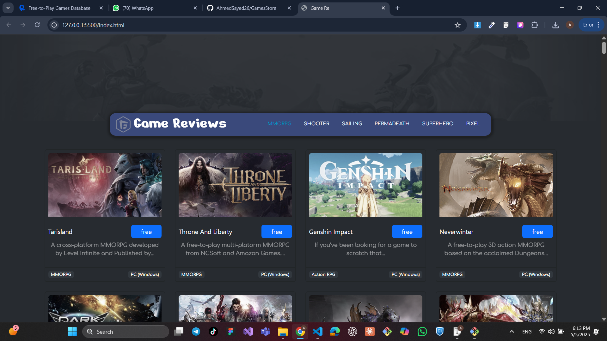

# 🎮 Free-to-Play Games Browser

An interactive and modern web app that lets you explore a variety of free-to-play games by category, view detailed game info, and enjoy a sleek, responsive UI — powered by the Free-to-Play Games Database API.

## 🔥 Key Features
 - 🧭 Category-Based Browsing
 - 🔹 Filter games by categories such as MMORPG, Shooter, Strategy, and more
 - 🔹 Active category is visually highlighted

##🖼️ Game Grid Display
 - 🟩 Each game is shown in a responsive card with:
 - ✅ Game title
 - ✅ Thumbnail image
 - ✅ Short description
 - ✅ Genre and platform
 - ✅ “Free” tag button

## 🔍 Detailed Game View (Popup)
 🖱️ Click any game to view more details in a popup:
 📌 High-quality image
 📌 Full game description
 📌 Genre, platform, and status
 📌 Direct link to play the game

# ⚡ Smooth UI & UX
  🌀 Loader animation while fetching data
 📌 Sticky navigation bar on scroll
 🎨 Clean and modern Bootstrap-based design

🛠️ Built With

✅ Vanilla JavaScript (ES6+)

✅ HTML5 & CSS3

✅ Bootstrap 5

✅ RapidAPI – Free-to-Play Games Database

# 🖼️ Screenshots
- 

#🚀 Getting Started With demo 
https://ahmedsayed26.github.io/GamesStore/
